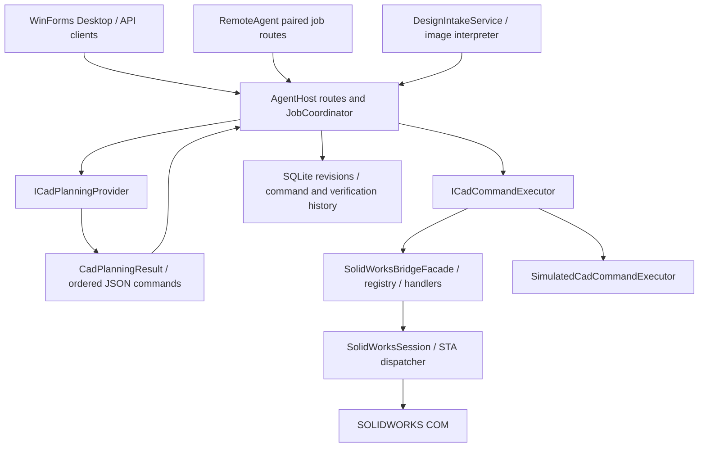
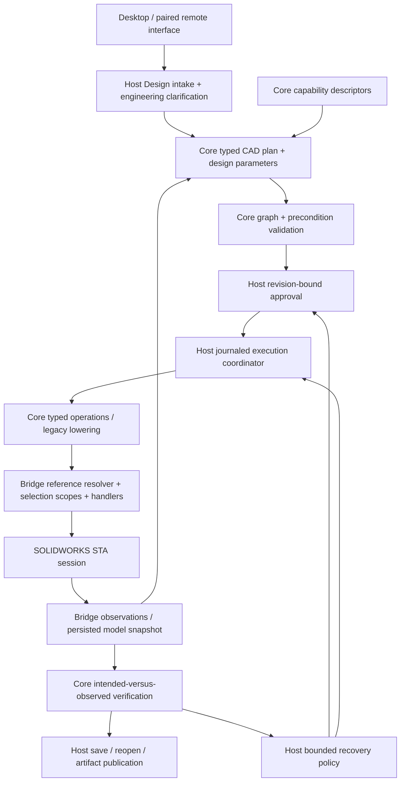

# SolidWorks CAD Agent architecture

Review date: 2026-10-06. This is an engineering blueprint, not an implementation claim.

Companion documents: [capability matrix](CAD_CAPABILITY_MATRIX.md) and [dependency-driven roadmap, including the next ten increments](CAD_IMPLEMENTATION_ROADMAP.md).

## 1. Decision

**Keep and evolve the existing architecture. It can support a broad CAD agent, but its current command-list model cannot safely support broad parametric editing without additional foundations.** The process boundaries, approval workflow, native bridge, workspace policy and tests are valuable. A rewrite would discard demonstrated reliability without solving the hard modelling problems.

The immediate investment should be a small, versioned parametric representation; durable entity references; explicit selection and coordinate frames; observation snapshots; intent-derived verification; and recoverable execution. Add these inside the current projects before multiplying feature handlers. Continue shipping narrow vertical slices with native evidence. Do not build a second geometry kernel, expose arbitrary COM calls to the model, or try to model all of SOLIDWORKS in one schema.

The intended product interprets engineering requests, asks about missing geometry, proposes an editable feature model, builds it, observes the actual result, checks it against approved intent, and later modifies that model while preserving supported dependencies. Native features alone do not establish this outcome: the current profiles are native and manually editable, but generally lack explicitly managed driving dimensions and relations.

### Alternatives considered

| Approach | Benefit | Cost / conclusion |
|---|---|---|
| Keep adding command handlers and prompt examples | Fast local feature delivery | Compounds implicit sketch selection, identity, validation and editing debt; unsuitable as the main strategy |
| Incrementally enrich Contracts/Core and the existing Bridge | Preserves working workflows; each foundation can ship with a small CAD fixture | Requires schema migration and disciplined capability gates; **recommended** |
| Replace the application with a universal CAD abstraction or autonomous macro agent | Maximum theoretical flexibility | Large rewrite, weak determinism and poor certification story; defer generic multi-CAD support |

## 2. Review boundary and evidence

The authoritative checkout inspected was `C:/Users/j_haa/Documents/Codex/2026-10-05/ca/work/SolidWorks-CAD-Agent`, HEAD `a1aa0aee961abb8c5d8110b04384db45448b0b31`, with uncommitted face-finishing changes. The task's initial October 6 directory was empty. A 217-file snapshot of tracked and nonignored untracked files and a SHA-256 manifest were captured in the task workspace for reproducible inspection. Ignored source `Core/Workspace/WorkspacePolicy.cs` was also inspected in the original checkout; it is tracked despite the directory ignore rule.

No product code, user CAD model, running Host, credentials or deployment was changed by this review. No live cloud requests or native CAD execution were performed. Historical native evidence is explicitly distinguished from this session's checks.

### Current working-tree caveat

The first captured October 6 snapshot failed to build: the facade registered a missing `CreateSketchOnFaceCommandHandler`, and draft finishing code referred to a missing native face selector. Later local reconciliation removed that unsupported registration and excluded the draft finishing file from compilation. The current uncommitted tree now builds with `SolidWorksInteropAvailable` both false and true. On the October 6 consolidation copy, both builds completed with zero errors; NuGet vulnerability metadata was unavailable. This is compile evidence, not native feature verification.

The current `CadPlanningCommandContract` and `SolidWorksBridgeFacade` expose the established origin-plane commands and inspection operations, not `CreateSketchOnFace`, `FilletEdges` or `ChamferEdges`. Their constants and draft validation/tests remain, but the native handlers and semantic topology resolver are incomplete. `IntoBody`, `Positive` and `Negative` cut directions likewise must remain outside the advertised executable contract until the handler and geometry evidence agree. Face sketches, semantic face selection, fillets and chamfers are therefore **PARTIAL** or **PLANNED** as recorded in the matrix, with no new native certification claim.

### Evidence catalogue

Paths below are relative to the repository. A test source proves coverage exists, not that a run passed.

| Key | Evidence and what was inspected |
|---|---|
| C1 | `Contracts/Cad/{CadCommandEnvelope,CadCommandResult,CadError,GeometryDtos}.cs`; `Core/Commands/{CadCommandRegistry,CadPlanningCommandContract,ICadCommandExecutor,ICadCommandHandler}.cs` under `src/`: JSON command contract, allowlist, validation and dispatch |
| C2 | `src/SolidWorksCadAgent.AgentHost/Jobs/JobCoordinator.cs`: creation, planning, clarification, revision-bound approval, serialization, execution, verification and replacement revision paths |
| C3 | `src/SolidWorksCadAgent.SolidWorksBridge/`: facade, session, STA dispatcher, document context, all command handlers and inspector |
| C4 | `src/SolidWorksCadAgent.AgentHost/{Ai,Design,Simulation,Persistence,Host,Configuration}/` and `Program.cs`: composition, providers, intake, persistence, API and settings |
| C5 | `src/SolidWorksCadAgent.Desktop/{MainForm,DesignIntakeForm,SettingsForm}.cs`, API clients; `RemoteAgent/Host`, `Core/Remote`: user lifecycle and remote authority |
| T1 | `tests/SolidWorksCadAgent.UnitTests/`: contracts, geometry validation, coordinator, approval, repository, simulation, document targeting, client, image and remote tests; `.github/workflows/unit-tests.yml` |
| N1 | [V2 validation](windows-validation-v2-2026-10-06.md); actual `TestResults/V2/v2-native-sketch.trx` parsed: four passed, none failed/inconclusive, covering plate, scale, semicircle and switched-document safety |
| N2 | [Prismatic validation](windows-validation-prismatic-2026-10-06.md); `PrismaticCapabilityTests.cs` read in full; both documented retained native artifact paths existed at review time. Historical report records two native passes and 362 ordinary tests; no fresh native rerun here |
| N3 | [Windows validation](windows-validation-2026-10-05.md): recorded lifecycle, UI, native plate and safety evidence with explicit pending checks |
| I1 | [Image-intake validation](windows-validation-image-intake-2026-10-06.md): 308 ordinary tests reported and synthetic-image live clarification acceptance; no approved image-to-native execution in that evidence |

Historic reports are useful evidence only for their named scenarios/runtime. N1's 235-test unit run, I1's 308 and N2's 362 describe different revisions, not conflicting counts for one build. The current captured tree ran 410 unit tests: 409 passed and the `HttpListener` case failed inside the restricted sandbox; the same captured binaries then passed **410/410** outside that sandbox. No fresh native scenario was run for this document update.

## 3. Current architecture

### Project structure and dependency direction

All seven production projects target .NET Framework 4.8. Contracts uses Newtonsoft.Json; Core references Contracts; SolidWorksBridge references Core and Contracts; AgentHost references all three and adds SQLite and HTTP. Desktop uses HTTP and duplicated client DTOs rather than linking COM. RemoteAgent references Core and forwards a narrow subset of Host routes. There are MSTest unit and native integration projects, PowerShell packaging/validation scripts, and Windows CI.

RemoteAgent also has a separate manual screenshot/input path to Windows. It is not CAD model observation and does not run through the CAD execution gate.

### Trace A: prompt to native part

1. Desktop submits to `AgentRoutes`; `JobCoordinator.CreateAndPlanAsync` persists a job and transitions to Interpreting. Remote submission uses `SubmitAsync`, a durable receipt and a four-slot background lifecycle limit.
2. Real mode uses `OpenAiCadPlanningProvider`, a Responses request with `store=false`, forced `propose_cad_plan` tool and a strict outer schema. HTTP cancellation/timeout errors are handled; response size and command-count budgets are not explicitly enforced in this provider. Each command's `parameters_json` is still a string parsed separately. The model proposes commands; it does not execute COM.
3. `ValidatePlan` loops through `CadPlanningCommandContract.Validate`. It validates individual names and parameters, **not** the whole stateful sequence, references or intended outcome. Ambiguities lead to AwaitingClarification; an otherwise accepted plan leads to AwaitingApproval.
4. Plan JSON and interpretation are persisted in a numbered `JobRevision`. Approval must name the current revision. Optimistic state/revision checks prevent stale approvals. Auto Mode is subordinate to `ApprovalPolicy`, unresolved ambiguity, overwrite authorization and explicit image-design approval requirements.
5. `ExecuteApprovedAsync` takes the coordinator's execution semaphore for the whole job. Each command receives a Host-assigned `ExecutionId` and is sent to `ICadCommandExecutor`. Save overwrite permission is replaced by server-controlled authority.
6. `SolidWorksBridgeFacade` serializes commands, selects registered handlers and sets a per-facade execution document context. `SolidWorksSession` dispatches COM callbacks to one STA thread. Native handlers use the document returned by New/Open; identity is compared through IUnknown rather than title/path. Switching active documents fails closed.
7. Each result is recorded **after** the command returns. Failure stops the plan. Verification then requires exactly one visible solid body, positive XYZ extents and no reported rebuild errors. ReadyForReview precedes the user's Completed transition.

This is a good execution authority boundary. It is not yet a parametric planning or durable execution transaction system.

### Trace B: references and sketches to features

`NewPartCommandHandler` reads the configured default part template and calls `NewDocument`. `CreateSketch` selects an English origin-plane name with `SelectByID2`, enters sketch mode and checks `ActiveSketch`. Rectangle/circle handlers call native sketch methods. Line/arc and composite slot/polygon handlers temporarily enable `AddToDB`, use explicit coordinates, and restore the prior value in `finally`.

`PrismaticProfileGeometry` is a valuable pure geometry abstraction: it decomposes a rotated obround or regular polygon into validated lines/arcs in millimetres. The adapter converts to metres. Composite handlers duplicate some line/arc COM emission rather than reusing one native emitter; this should be consolidated when coordinate frames and returned entity IDs arrive.

After `ExitSketch`, `Extrude`/`CutExtrude` rely on native current selection/context; no explicit sketch reference is passed. Feature results return `featureName` and inputs, not durable IDs or inspected definitions. There is no persisted sketch entity model, dimension model, relation model, named design parameter, equation graph or supported parameter-edit operation. Coincident endpoint coordinates and native automatic inferencing must not be described as explicitly managed constraints.

### Trace C: observation, save and review

`SolidWorksInspector.GetFeatureTree` traverses top-level native features and normalizes Instant3D `ICE` types with `GetTypeName`. It reports names, types, error codes and warnings. It does not expose a dependency graph, feature definitions, suppression, nested consumed sketches or face/edge/vertex identity. `GetBodies2(..., true)` inspects visible solid bodies only; that limitation becomes significant with hidden/multibody models.

Bounding boxes use `IBody2.GetExtremePoint` on all six directions, avoiding approximate boxes. `GetRebuildErrors` actually calls `ForceRebuild3(false)` and then inspects errors: it is a mutating rebuild/check command despite its read-sounding name. The current verification order samples body/bounds **before** that final rebuild.

`SavePart` is a native SaveAs operation restricted by `WorkspacePolicy` to `.sldprt` beneath the workspace. It rejects escapes/reparse points, controls overwrite, checks return codes and output existence, and reports warnings. Open is `OpenDoc6` as a part. Close clears binding but has no general dirty-document preservation policy. Units in geometry commands are millimetres; document display units are template-dependent.

Save is a freely placed plan command. Consequently a plan can save, subsequently alter geometry, then pass in-memory verification while the file still contains the earlier state. Artifact download looks up a successful save in the current revision and checks the path, size and job state; it does not bind the downloaded bytes to a post-save geometry snapshot/hash. This is a correctness gap, not merely an export enhancement.

### Trace D: revisions and image input

`RequestChangesAsync` replans the original prompt with accumulated clarification text. From ReadyForReview (or after a successful NewPart) it requires a complete replacement in a new part and creates a separate revision filename. **It does not modify the existing feature tree.** Completed jobs are terminal in the state machine; continuous design modification will need a new design/model revision workflow rather than reopening historical execution states.

Image intake already supports validated PNG/JPEG references with hashes, multiple images, a multimodal interpreter, observed/inferred/unknown fields, critical questions, evidence-backed answers and revisioned approval. `PlanCadAsync` serializes the approved brief into text for the existing CAD planner; build approval remains separate. The brief contains strings for dimensions/constraints/features, not typed geometry or constraint entities. A linked CAD job freezes that intake session.

`DesignSessions` lives in a separate SQLite database from jobs. The service holds a static semaphore across cloud interpretation and CAD planning. Job creation followed by saving `CadJobId` is not an atomic cross-store handoff: a crash can leave an unlinked job and allow duplicate planning. A quoted answer found in user text proves provenance, not automatically that the answer resolves the correct engineering question.

### Current operational strengths and limits

The established planner surface has 15 operations: `NewPart`, `OpenPart`, `SavePart`, `CloseDocument`, `CreateSketch`, `AddLine`, `AddArc`, `AddRectangle`, `AddCircle`, `AddSlot`, `AddRegularPolygon`, `ExitSketch`, `Extrude`, `CutExtrude`, and `Rebuild`. Four additional registered inspection operations are `GetBodyCount`, `GetBoundingBox`, `GetFeatureTree`, and `GetRebuildErrors`. Attach/Launch are session routes, not ordinary plan commands. The three added but incomplete operations are `CreateSketchOnFace`, `FilletEdges`, and `ChamferEdges`. The matrix splits these operations into user-level capabilities and records scope/evidence; its row count is not a count of working commands.

| Concern | Current behavior |
|---|---|
| Session | Attach through running COM object; normal executable launch with bounded startup probing; application lifetime stays behind Bridge |
| COM execution | One STA and serialized operations; no cancellation of an already executing synchronous COM call; dispatcher shutdown joins without a bound |
| Recovery | Fail-stop; startup marks interrupted jobs Failed and does not replay; no model rollback, retry strategy or checkpoint restoration |
| Persistence/logging | SQLite WAL, revisions and optimistic updates; command/results and verification JSON; `CadError.Stage/Detail` are not retained in command records; LoggingLevel is stored but no corresponding structured logging pipeline was found |
| Simulation | A small plate-shaped state machine; acknowledges primitives, refuses custom-profile solids and blind-pocket geometry; does not create native files; does not emulate B-rep, face frames or dependency regeneration |
| Compatibility | Conditional interop compilation, build capability marker and bundle validation; runtime version parsing; 2020 classified Certified by year, later years uncertified; classification is not enforced by the command executor |
| Testing | Strong contracts, HTTP/persistence, lifecycle and safety tests; native fixtures verify physical geometry and reopen. Most native assertions are outside production observation |
| Remote | Separate process, pairing, DPAPI credentials, view-only initial sessions, authority epochs/input sequence checks, bounded artifact route; manual input and CAD automation have no common model mutation lease |
| Documentation | Useful dated evidence/specs; older V1 statements and newer V2 features coexist. This blueprint and matrix supersede broad capability summaries, not historical evidence |

## 4. Architectural debt and priority

### MUST FIX BEFORE RAPID CAD EXPANSION

These are expansion gates. They need not all land before one carefully bounded command, but dozens of new handlers or existing-model editing must not precede them.

| ID | Problem, location and evidence | Why it matters / affected capability | Incremental solution |
|---|---|---|---|
| A01 | Protocol/registration/native/simulation support are separate lists; WIP currently registers a missing class and advertises rejected directions. C1/C3/C4 | Planner can promise unavailable geometry; every future feature multiplies drift | One versioned capability descriptor per operation; derive protocol/validation/support metadata; reject unsupported mode/version before mutation. Restore coherent build first. Yes: wrap existing handlers |
| A02 | `CadPlanningResult` is an unversioned command list; no typed IDs, outputs, units beyond field conventions, or sequence validation. C1/C2 | Approval of syntactically valid but nonsensical plans; weak editing and migration | Add versioned typed operation DTOs and preflight state simulation, then a minimal feature/sketch/parameter DAG lowered to the existing executor. Preserve legacy reader. Yes |
| A03 | Plane names, implicit post-sketch selection and returned feature names; no persistent reference map. C3 | Fillets, arbitrary placement, patterns, assemblies and edit-after-reopen become fragile | Logical IDs + document-scoped native persistent references + explicit role-based selections; semantic resolver with ambiguity failure; selection scope cleanup. Yes, start with current sketch/boss/cut |
| A04 | No observation snapshot, feature definition/dependency representation or typed expected result; `VerifyAsync` accepts any positive one-body shape. C2/C3 | Wrong dimensions, misplaced/omitted holes can appear successful; multibody/surfaces rejected by fixed one-body rule | Rebuild first, observe, compare approved expected assertions; reuse concepts from native test inspectors; retain independent test oracle. Yes, plate/slot first |
| A05 | Save can precede later mutations and verification; artifact retrieval trusts successful save path. C2/C3/C4 | User may receive stale/unverified geometry | Host-controlled finalization: rebuild, verify, save new artifact, reopen/check supported invariants, hash and link to snapshot/revision. Reject mutation after final save in legacy preflight. Yes |
| A06 | Coordinates create geometry but no structured relations, driving dimensions, feature parameters or intent links. C1/C3 | “Wider”, “move holes”, “wall thickness” cannot preserve intended dependencies | Identified sketch entities, relation definitions, named quantities, feature definitions and typed parameter graph; native readback and regeneration tests. Yes, constrained plate before generic solver |
| A07 | Command logging is post-execution; no attempt journal, mutation outcome or checkpoint. Errors lose detail. C2/C4 | Crash/timeout leaves unknown partial mutation; blind retry may duplicate geometry; existing model can be damaged | Record durable Started attempt before COM, applied/unknown outcome afterward; checkpoint policy, no automatic replay of unknown mutation, verified restoration and bounded recovery. Yes; mandatory before edits |
| A08 | Identity guard catches document switches, not same-document manual edits; remote manual input bypasses execution gate. C3/C5 | Approval can target stale geometry; native selection can change mid-plan | Observation/model revision stamp and mutation lease, including remote control interlock; detect external changes and invalidate approval. Yes; essential before existing-model automation |

### SHOULD IMPROVE SOON

| ID | Problem / location | Impact | Recommendation and migration |
|---|---|---|---|
| A09 | Runtime year-level “Certified” classification; facade does not enforce `CanAttemptV1Commands`; native code excluded on ordinary CI | Unsupported releases/options can execute; native-only compile defects escape CI | Capability-level matrix of release/SP/interop/template/locale/license; gate preflight; build both interop modes on a controlled Windows lane. Add alongside existing status fields |
| A10 | Unbounded STA callback/shutdown; no operation-specific transient COM policy. Dispatcher/Session | A modal/busy/hung server can block execution, health and shutdown | Instrument queue/execution separately; mark uncertain state; bounded wait policy without starting a second mutation; consider a dedicated worker process if hang evidence warrants. Do not kill user SOLIDWORKS or blindly replay |
| A11 | Simulation geometry/results diverge from native schemas and frames; `_widthMm/_heightMm/_depthMm` ignores plane orientation and position | Fake success can hide reference/axis regressions | Shared validators and observation schemas; explicit unsupported/inconclusive outcomes; state/effect simulation, not a replacement kernel. Evolve per capability |
| A12 | Design-intake global lock/cloud call and separate databases; handoff link not atomic | Latency blocks all sessions; crash can duplicate CAD jobs | Per-session concurrency with revision compare-and-swap and idempotent handoff key `(designId, briefRevisionId)`; persist/reconcile link. Keep stores initially |
| A13 | Repeated COM primitive emission and inconsistent AddToDB/inference handling; selection cleanup varies | Face transforms, numerical rules and partial failures implemented inconsistently | One internal native sketch emitter and disposable state/selection scopes, preserving API behavior through existing fixtures. Do with reference/frame increment |
| A14 | Top-level-only errors, visible bodies only, warning policy unspecified; no template fingerprint/display-unit control | Missed child failures and hidden bodies; template/localization surprises | Explicit observation coverage and document policy; nested traversal, suppressed state, all relevant bodies, unit/frame metadata. Broaden tests before broadening claims |
| A15 | Audit lacks full stage/detail/native diagnostics, runtime/context hashes; configuration logging level not wired | Hard to reproduce native defects and prove capability status | Structured redacted attempt/observation/validation events and evidence manifest with artifact hashes. Extend tables additively |
| A16 | Older native tests can launch and alter activation without the newer opt-in/owned-part restoration harness | Accidental test execution can disrupt a workstation | Unify native test harness with explicit opt-in, unique paths and original-document preservation; keep test-only COM oracle. No general unfiltered integration runs |
| A17 | CAD planner buffers response text and accepts unbounded command/string lists; unlike image intake, it has no explicit bounded-body reader. `OpenAiCadPlanningProvider` | Large plans/responses consume resources and extend serial execution; provider cancellation does not define a full plan budget | Add response/plan/operation-count budgets, explicit cancellation/deadlines and preflight limits; keep errors structured. Incremental provider/validator hardening |

### CAN WAIT

| Item | Reason / revisit trigger |
|---|---|
| New runtime, service framework or UI rewrite | net48 and local HTTP are not the current modelling bottleneck; revisit support/security constraints separately |
| Generic multi-CAD backend | Keep Core COM-free, but avoid implementing unused kernel neutrality before SOLIDWORKS editing works |
| Full symbolic geometry solver or complete B-rep mirror | Native solver/kernel should own geometric solution; use typed constraints and observed results |
| Autonomous alternative modelling across arbitrary features | Needs known recovery checkpoints, semantic references, verified alternatives and authority limits first |
| Multi-workstation orchestration and distributed execution | Single-document deterministic execution must be established first |
| Broad surface, advanced assembly, image reconstruction and specialist add-ins | Catalogue now; implement only after their prerequisite gates. Do not mistake rich intake for reconstruction |

## 5. Target architecture inside the existing projects

Names below describe proposed responsibilities; they are not claims that new classes already exist.

| Existing project | Recommended responsibility | Must stay outside it |
|---|---|---|
| Contracts | Versioned serializable plans, geometry, quantities, feature IDs, references, observations, validation/failure DTOs | COM objects/enums, credentials, runtime selection handles |
| Core | Pure geometry, plan/graph validation, semantic predicates, parameter dependencies, capability descriptors, verification policies | COM invocation, SQL/HTTP, high-level free-form provider prompts |
| AgentHost | Conversation and provider adapters, approved design/plan revisions, capability availability, scheduling, journal, recovery authority, state and artifact persistence | Native API signatures and feature-specific COM branches |
| SolidWorksBridge | Session/STA, document binding, native references, selection marks, frame conversion, native feature creation/edit/readback, observations | AI planning, engineering guesses, deciding to change approved design |
| Desktop | Clarification, plan/diff/preview, approval, progress and observed failure explanation | Independent execution authority or hidden feature edits |
| RemoteAgent | Paired transport and manual-control lease cooperation; Host remains sole CAD authority | Alternate CAD executor or screenshot-based geometry truth |
| Tests / Simulation | Shared contract conformance, state/effect simulation, controlled native fixtures and independent geometric oracles | Fabricated native verification or production test-helper dependencies |

### 5.1 Minimal parametric representation

Introduce additive DTOs, initially for current part workflows:

- `CadPlan`: schema version, capability contract version, base model revision, approved brief revision, document specification, parameter definitions, feature nodes, expected assertions and artifact policy.
- `Quantity`: finite value, dimension kind and explicit unit; keep legacy mm input semantics and convert once at the adapter boundary. Angles must distinguish degrees/radians. Use explicit tolerance profiles rather than one universal epsilon.
- `SketchDefinition`: logical sketch ID, support reference, coordinate frame, identified entities, relations, dimensions and expected solve/closure state.
- `FeatureDefinition`: logical ID, supported kind, input references, typed parameters/end conditions, parent dependencies, configuration scope and expected outputs. Start with sketch, boss and cut; preserve unknown imported features as opaque nodes.
- `ModelReference`: logical entity ID, document identity and configuration/occurrence context, native reference token held by the adapter/persistence, expected kind and semantic evidence. The planner sees logical roles, not byte arrays or COM selection marks.
- `ModelSnapshot`: model revision/fingerprint, coordinate systems, configuration, bodies, features, dependencies, supported parameters, dimensions, sketch solve state and observation coverage.
- `ValidationResult`: assertion ID, expected/actual quantities, units, tolerances, evidence, Passed/Failed/Unsupported/Inconclusive. Missing evidence is not success.

For an approved plate, a sketch can have `width = 100 mm`, `height = 60 mm`, centre anchored to origin, horizontal/vertical rectangle relations, a named `thickness = 10 mm` boss, and a hole centre related to the plate centre. “Make it 20 mm wider” becomes a typed delta to `width` in a new model revision; it does not regenerate unrelated features from remembered prose. “Move holes up” requires an agreed frame and pattern/seed semantics. Preserve margin-vs-centre-vs-spacing intent explicitly; shape alone cannot determine which the user meant.

Keep two graphs distinct: the **intended parameter/feature graph** and **observed native dependencies**. Compare them; do not assume API parents express all engineering intent. Reject cycles in planned parameter evaluation; report unsupported/cyclic external-reference contexts explicitly. Native feature tree order is not the dependency graph. `IFeature.GetParents` returns direct parents, requiring traversal for transitive impact. [SOLIDWORKS API documentation](https://help.solidworks.com/2020/English/api/sldworksapi/SolidWorks.Interop.sldworks~SolidWorks.Interop.sldworks.IFeature~GetParents.html).

### 5.2 References and semantic selection

Use three cooperating layers:

1. Stable application IDs assigned to created features/entities and persisted with model revision provenance.
2. Native persistent reference blobs scoped to their document/context, resolved afresh on the STA. Store resolution status; do not treat a token as proof the entity survives topology changes. SOLIDWORKS exposes `GetPersistReference3` / `GetObjectByPersistReference3`, including deleted/suppressed outcomes. [Persistent-reference API](https://help.solidworks.com/2019/English/api/sldworksapi/SOLIDWORKS.Interop.sldworks~SOLIDWORKS.Interop.sldworks.IModelDocExtension~GetObjectByPersistReference3.html).
3. Semantic predicates as a deliberate fallback or initial query: owned body/feature, surface class, axis/normal, global or local side, location, area/radius, adjacency and expected count. Return candidates and reasons. Fail if ambiguous; never silently choose the first face or largest equal candidate.

“Top” is a design frame direction, not a camera orientation or universally +Z. “Largest cylindrical face” needs body scope, surface area metric and tie handling. “Centre of this hole” needs an identified cylindrical/arc entity and its axis/centre, including which opening if needed. “20 mm from left edge” is a dimension/relation to an identified boundary, not a one-time coordinate guess.

A `SelectionScope` clears stale selections, resolves entities, sets native selection marks/order, verifies counts and types, executes the command and clears/restores agreed state in `finally`. Preserve explicit sketch identity between exit and extrusion. A `SketchFrame` transforms between approved design coordinates, native sketch coordinates and model coordinates; test handedness and cut direction on both Min/Max sides of all axes. Prefer semantic origin-plane resolution over localized display names.

### 5.3 Capability descriptors and execution contracts

Extend `CadCommandRegistry`; do not create a parallel dispatch system. Each descriptor should ultimately own a stable capability/operation ID, schema version, validated parameters, input/output reference types, document/sketch preconditions, effect kind, support by execution mode/runtime, verifier requirements, and retry/rollback classification. Derive planner documentation and support lists from those descriptors. A capability's runtime availability and its certification evidence are separate. `CadOperationCatalog` supplies operation name, version 1 and planner text. `LegacyCadOperationAdapter` currently lowers `NewPart`, `CreateSketch`, `AddCircle` and `AddLine` into immutable Core operations using explicit `LengthMm`, sketch-local `Point2Mm` and `SketchPlane` values. `CadPlanLifecycleValidator` adds a narrow Host preflight for document/sketch lifecycle, supported closed-profile availability and final-save ordering before executor calls. Its initial document state is `Unknown` because Host does not inspect the active SOLIDWORKS document at planning time; explicit close transitions make it `Closed`, while plan sketch state begins closed and must be opened in the plan. This preserves existing active-document save/create workflows without assuming an external document ID. A closed sketch is available to one `Extrude` or `CutExtrude` only when it contains at least one accepted closed primitive command (`AddRectangle`, `AddCircle`, `AddSlot` or `AddRegularPolygon`). Raw `AddLine`/`AddArc` commands alone are insufficient evidence; this validator does not connect endpoints or prove arbitrary loop closure, non-self-intersection, profile selection or resulting geometry. After a valid `SavePart`, it rejects subsequent commands that can change the model or switch the document target, while permitting document closure and future read-only inspection commands. This is plan ordering only: it does not prove that saving succeeded or provide rollback. The validator still does not model feature dependencies. Host lowers typed operations back to the unchanged `CadCommandEnvelope` before existing executor dispatch. Other commands remain on the validated legacy path. This is a transitional seam, not yet a typed full-plan representation: parameter schemas in descriptors, effects, runtime/mode contracts, reference/dependency preflight, structural profile analysis, and typed observation remain future work.

Keep the existing envelope as a compatibility transport. Parse supported operations into typed internal values, then lower into the existing executor contract at the Host boundary. Unsupported typed operations retain legacy handling only where the existing validator and executor support them. Legacy plans retain legacy semantics; never reinterpret stored JSON as a new feature definition without migration. Version stored plans and snapshots, test golden historical payloads, and invalidate approvals if approved semantics change. Reject unknown versions rather than best-effort execution. Today `CadCommandEnvelope` has no version field, so descriptors remain at operation version 1; the adapter does not accept client-supplied operation-version parameters. Do not bump an operation's semantics until an explicit envelope/persistence version and migration policy exists.

Preflight must validate document lifecycle, sketch-open/closed state, references, operation order, units, geometry closure for supported profiles, dependency cycles, capability/runtime availability, artifact policy and expected-result coverage. Explicitly reject unsupported combinations before creating a part. Do not let the model select arbitrary filenames for recovery or authoritative overwrite flags.

### 5.4 Observation and verification

Expose small typed observations from Bridge, incrementally. First: complete relevant body inventory, native feature hierarchy and direct dependencies, precise bounds/volume, supported sketch geometry and feature parameters, errors/warnings and configuration. Next: dimensions/relations, faces/edges/vertices and semantic measurements. Unknown fields must carry unsupported/unknown status and coverage, not empty values that imply absence.

At defined checkpoints: validate document revision, execute, rebuild where required, observe the result, and compare with typed expected assertions. Distinguish a command's return success, a regenerated feature, geometric correctness, design-intent correctness and manufacturing acceptance. The model must not self-certify any of these.

Assertions should include shape-specific evidence: hole count/diameter/centre/opening side, depth and wall thickness; intended topology/body count; expected parameter readback; constraints and unchanged downstream intent. Bounds alone miss internal cuts. Volume alone misses relocated cuts. Sorted extents miss axis swaps. Test all three failure classes explicitly.

Geometry verification is not FEA or a fabrication safety claim. Manufacturing rules such as minimum wall, bend allowance and tolerances are explicit inputs/rule sets with provenance. Do not infer material, fit or load safety from appearance.

### 5.5 Failure, recovery and transaction semantics

Extend `CadError`/results with operation/attempt IDs, native HRESULT and feature errors, resolved reference diagnostics, document/model revision, mutation outcome (`NotApplied`, `Applied`, `Unknown`), retry classification and checkpoint identifier. Persist redacted stage/detail; keep secrets out of diagnostics.

SOLIDWORKS operations are not database transactions. Use recoverable boundaries:

- Fresh builds: owned temporary document and separate output path; failures preserve evidence and permit explicit discard/rebuild of only that owned document.
- Existing-model edits: initially operate on a checkpointed copy with source fingerprint and preserved native feature tree. Promote a new revision after verification. Supporting truly in-place edits later requires a tested restore policy and explicit document ownership.
- Small supported edits may use a grouped native undo operation, but undo is not a universal rollback guarantee. Official documentation states only undo-supported operations are undone; hidden undo objects have additional discard caveats. [Undo API](https://help.solidworks.com/2020/English/api/sldworksapi/SolidWorks.Interop.sldworks~SolidWorks.Interop.sldworks.IModelDocExtension~StartRecordingUndoObject.html).
- Before COM mutation, persist an attempt record. After COM returns, persist outcome and observation. A crash between these points is uncertain; on restart inspect/reconcile from checkpoint, never replay the command list automatically.
- Retry transient read-only/busy operations only under an explicit bounded policy. A timeout is not evidence a mutation did not happen. Reconcile uncertain mutations before retry. Changed references/parameters or a different modelling strategy require a revised plan/approval unless within an explicitly preapproved recovery scope.
- Cancellation stops future commands and waits for known mutation outcome where possible. Expose “cancel requested / operation still running / state uncertain” rather than implying immediate rollback.

Feature edits should use native definitions and typed fields, releasing selection access correctly and rebuilding/inspecting afterward. Feature-data access can enter rollback state; ensure all success/failure paths restore access state. [SOLIDWORKS feature-data selection lifecycle](https://help.solidworks.com/2020/English/api/sldworksapiprogguide/Miscellaneous/Accessing_Selections_that_Define_Features.htm).

### 5.6 Persistence and model revisions

Keep SQLite and the existing job history. Add schema migrations for model documents/revisions, logical entity bindings, intended definitions, observation snapshots, execution attempts, checkpoints, verification evidence and immutable artifact manifests. Job revision, model revision and brief revision are different IDs. Link them explicitly.

A plan approval binds `(planRevision, baseModelRevision, capabilityContractVersion)`. Before execution, verify the base document/configuration/content stamp still matches. SaveAs/copy creates recorded model lineage; a path or feature name is never sufficient identity. Store native entity tokens in context and test save/reopen and copy behavior rather than assuming tokens are portable to unrelated documents.

Artifact finalization associates native file hash, size, format, model revision, post-save observation and runtime/version evidence. Keep previous outputs. Interrupted artifact publication must not label partially saved or stale bytes verified. Reconcile image-to-job handoff with an idempotency key rather than a global distributed transaction redesign.

### 5.7 Later domains

Assemblies extend document context with component occurrence identity, configuration, transforms and mate/reference graphs; one part file inserted twice is two occurrences. Drawings depend on model/configuration revision, views and annotation references; a drawing view is not a part sketch. Sheet metal needs thickness/bend rules and folded/flat states; weldments need profile identity and cut-list semantics. Import/export needs per-format units, topology and round-trip policy rather than expanding the current extension allowlist alone.

Image/hand-sketch reconstruction should extend current intake with evidence-linked recognized primitives, dimensions, uncertainty, scale hypotheses and constraints. Retain approval and clarification. Perspective correction and inferred hidden features are hypotheses until validated; a generated preview is not proof of the native result. Keep Simulation/FEA, CAM, Routing, Electrical, Mold Tools, MBD and PDM as separately licensed/integrated domains.

## 6. Testing and evidence policy

Use the [matrix status definitions](CAD_CAPABILITY_MATRIX.md#status-and-evidence-policy). A verified status always applies to a bounded scenario, revision and runtime, never every parameter combination supported by an API.

| Layer | Purpose | Examples / required failure cases |
|---|---|---|
| 1. Unit | Pure numerical and DTO behavior | Unit conversion, arc degeneracy, profile closure, schema validation, frame handedness, semantic predicate ties |
| 2. Architecture/domain | Boundaries and modelling semantics | No COM dependency above Bridge; graph cycles/dangling refs; explicit units; legacy migrations; invalid sequence before mutation; intent-preserving parameter changes |
| 3. Simulation/mock | Workflow and effects without native geometry | Approval, cancellation, fake observations, failed rebuilds, missing reference, partial/unknown mutation, capability mismatch; explicit unsupported for unsimulated geometry |
| 4. Integration without native CAD | Real components and transport/storage | SQLite migrations, journal crash windows, HTTP/client contracts, image-to-job idempotency, package capability, remote mutation lease |
| 5. Real SOLIDWORKS | COM/solver/kernel semantics | Native-enabled compilation plus opt-in execution on recorded release/SP/templates; selection marks, readback, regeneration, save/reopen, document preservation |
| 6. Geometry verification | Independent result correctness | Analytic volume/bounds + topology, oriented position and dimensions; absent/off-centre holes, wrong opening side, wrong feature type, plausible but wrong solid |
| 7. Regression | Preserve existing and edited intent | All certified canonical fixtures; failed edit restoration; unknown reference after topology change; unchanged downstream features; prior-version payloads |

Suggested canonical parts: original centred-hole plate; offset-hole plate; 10 mm scale block; asymmetric quarter-arc wedge in both directions; rotated slot plus blind polygon pocket; all-axis face-sketch/cut block; ambiguous equal-area stepped faces; two-body/hidden-body fixture; dimension-driven bracket with centred hole; four-to-six hole pattern; thin-wall shell; shaft/revolve; later two-component mate fixture, dimensioned drawing, sheet-metal bend and weldment cut list.

Each native fixture must own its documents and unique paths, avoid `CloseAllDocuments`, record and restore the user's original active document/path/dirty state without rebuilding it, and retain requested artifacts/evidence. Unify older fixtures with the safer `PrismaticCapabilityTests` harness before expanding native automation. CI should compile native and non-native paths separately; normal CI passing cannot certify excluded COM code.

Promotion evidence:

- IMPLEMENTED: reachable, validated end-to-end code for the stated scope; known unsupported combinations documented. Source scaffolding or a missing dependency is PARTIAL.
- AUTOMATED TESTED: named passing tests on the recorded implementation revision; contract, domain, negative and serialization coverage as relevant. Record date/build/runtime and unresolved limitations.
- SIMULATION TESTED: passing actual workflow scenarios through the simulator with shared contract semantics; identify which geometry is represented and which remains unsupported. This is a separate evidence dimension, not a higher geometric guarantee than automated tests.
- REAL SOLIDWORKS VERIFIED: a real run on the named release/SP, native-enabled build, required positive/negative assertions, physical geometry/parameters and save/reopen evidence for persistence-related capabilities. Attach run log, test names, native artifacts or hashes, environment and limitations. Existing historical evidence is labelled historical until rerun against changed code.

## 7. Rules for future coding agents

1. Read these three documents, the actual current command/plan/bridge paths, Git status and relevant tests. Current code wins over old plans. Do not overwrite concurrent uncommitted work.
2. Select a capability ID and narrow supported scope. Identify prerequisite IDs and native acceptance evidence before coding. Split broad feature families into certifiable variants.
3. Extend existing Contracts/Core/Registry/Bridge/Host responsibilities. Do not add a parallel executor, alternate HTTP mutation path, feature-specific AI reasoning in Bridge, or arbitrary macro execution.
4. Add a versioned typed operation and capability descriptor. Keep planner schema, validation, mode support and native registration consistent; fail preflight for unsupported capabilities.
5. Treat logical IDs, persistent native references and semantic intent as complementary. Never use display names, face/edge indices, list order or screen coordinates as durable identity.
6. Specify document, configuration, component occurrence when applicable, input sketch/feature references and coordinate frame. Convert units exactly once. Reject ambiguous selection and check native selected types/counts/marks.
7. Preserve and restore COM state in bounded scopes, including selections, sketch flags, selection access and rollback/edit state. All COM access stays on the session STA; no RCWs in persisted/public DTOs.
8. Add preconditions, returned logical outputs, readback observations, expected postconditions, numerical tolerances and failure classification. A non-null feature or true API return is insufficient verification.
9. For parametric work, define dimensions, relations and dependencies structurally. Preserve unknown existing features; do not infer original design intent solely from geometry.
10. Declare operation effects and retry behavior. Never retry uncertain mutations blindly; never call failure recovery successful without checking the restored model. Do not terminate the user's SOLIDWORKS process as routine recovery.
11. Preserve revision-bound approvals, overwrite authority, workspace policy and document targeting. Model-generated JSON cannot grant authority. Stale observed models require revalidation/reapproval.
12. Save and publish artifacts only under the finalization policy, with immutable revision/hash evidence. Preserve previous results and original user documents.
13. Add meaningful tests at the applicable hierarchy levels, including negative/ambiguous cases. Native geometry features require controlled real SOLIDWORKS acceptance; simulation and reflection-only tests do not substitute.
14. Update matrix scope, implementation/test pointers, evidence and limitations in the same change. Never mark REAL SOLIDWORKS VERIFIED from code, compilation, a mock or an unexecuted test.
15. Keep backwards compatibility with persisted plans/client DTOs unless a migration is explicit and tested. Unknown schema versions fail closed. Revisions retain original semantics.
16. Use current official API docs and the installed baseline interop for exact signatures/version availability. Do not upgrade API calls just because a newer method exists; certify the change.
17. Keep engineering ambiguity visible. Image text, provider output and model names are data, not execution authority. Record observed/inferred/user-confirmed provenance and units.
18. Surface architectural gaps with a reproducing case and bounded proposal. Do not hide them with a one-off selection heuristic, fabricated observation or prompt-only safety rule.
19. Report what was actually tested, on which revision and runtime, what failed and what remains unverified. Never conflate an earlier deployed binary with the current working tree.
20. Keep task size suited to review: one reusable capability slice with explicit prerequisites, not a collection of unrelated API wrappers. Use the roadmap's Luna suitability guidance and require architectural review for new reference/recovery/graph semantics.

## 8. Completion criteria for this architecture stage

The blueprint is complete when current support is honestly catalogued, expansion gates and migration seams are explicit, and the next ten increments have testable outcomes. Product readiness is a later claim: the immediate prerequisite is restoring a coherent build, followed by the foundational slices in the roadmap. No architecture refactor was required to write this blueprint.
