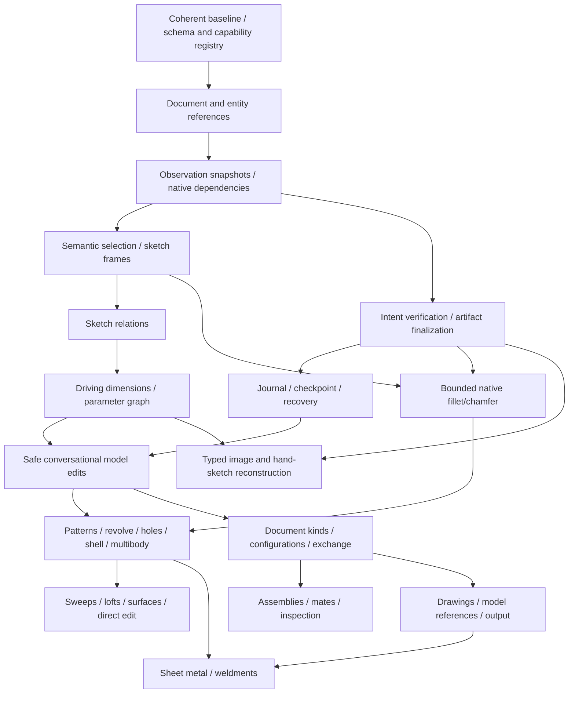

# SolidWorks CAD Agent implementation roadmap

Review date: 2026-10-06. Dependency-driven blueprint; no implementation sprint is authorized by this document itself. Read the [architecture assessment](CAD_AGENT_ARCHITECTURE.md) and [capability matrix](CAD_CAPABILITY_MATRIX.md) first.

## 1. Starting point and governing decision

Preserve Contracts, Core, AgentHost, SolidWorksBridge, Desktop, RemoteAgent, SQLite history, revision-bound approval, native document identity guards and current canonical part tests. Incrementally add a typed model and observation/verification loop around the existing executor. Do not replace a functioning layer simply to introduce a new architecture style.

The inspected checkout is at HEAD `a1aa0aee961abb8c5d8110b04384db45448b0b31` plus uncommitted face-finishing and lifecycle-preflight work. An initial snapshot had a missing face-sketch handler, but the current tree has reconciled planner exposure and native registration and builds in both interop modes. The unsupported face-sketch and finishing drafts remain unregistered; their direction/frame support is incomplete. Preserve that boundary while completing the remaining increment 1 acceptance work. Historical prismatic and line/arc native verification applies only to its earlier bounded scenarios.

This is not a toolbar sequence. Reliable identity, model observation and design parameters unlock many more capabilities than a collection of disconnected feature wrappers. Model understanding starts immediately, not after all feature creation is finished. Image intake is already present and must be extended rather than rebuilt.

## 2. Dependency graph and phase gates

Arrows show prerequisites, not a promise of parallel staffing. Small slices of a gate may be delivered with the first operation that needs them; do not create empty frameworks for every future feature.

| Phase | Purpose / capability groups | Prerequisites | Exit evidence |
|---|---|---|---|
| P0: trustworthy execution substrate | Coherent build, descriptors/schema, document/entity references, observation, selection/frame model, assertions and artifact lifecycle (increments 1–5) | Current guarded executor and evidence corpus | Invalid sequences rejected before mutation; referenced sketch/boss/cut survive reopen; wrong geometry fails; verified file matches reviewed model |
| P1: editable parametric parts | Identified entities, explicit relations/dimensions, parameter/feature graphs, checkpointed editing and bounded finishing (increments 6–10) | P0 | A dimension-driven plate/bracket survives width/thickness/hole-position changes, preserves specified intent, rejects unsafe changes and restores on failure |
| P2: reusable core part operations | Linear/circular patterns and mirrors; revolve/cut; reference planes/axes; Hole Wizard; shell/draft/rib; configuration-aware multibody and Booleans | P1, each feature's matrix prerequisites | Canonical fixture and edit/regenerate/reopen evidence for each bounded variant; count/body/wall assertions rather than generic one-body success |
| P3: advanced parts and understanding | Supported imported-model summaries, face/edge/vertex measurements, sweep/loft and guides, surfaces/knit/thicken, direct editing | P0 observations + P1 recovery + P2 scope-specific primitives | Unsupported definitions remain opaque; topology changes are detected and references rebound or rejected; independent geometric deviation checks |
| P4: document families and exchange | Configurations, properties/materials, STEP/Parasolid and later mesh/DXF/DWG, document kinds, occurrence/context groundwork, artifact lineage | P1 model revision discipline; P2 for multibody exports | Per-configuration validation, format policy and round-trip units/topology evidence; no extension-only “support” |
| P5: assemblies | Insert/fix/float/transform, basic mates, configuration and nested occurrence graph, mate diagnosis, interference/clearance, BOM information | P4, persistent occurrence references, transform composition, P0/P1 safety | Two-part fixture plus repeated-instance/subassembly fixture; mate and interference checks; save/reopen linked-document fidelity |
| P6: drawings | Model/configuration links, sheets/templates, standard/projected/section/detail views, dimensions/notes/callouts, BOM/title block and exports | P4; P5 only for assembly drawings/BOM, not simple part drawings | Readback of view scale/orientation, model revision, annotations and references; rendered output checks and update/dangling diagnosis |
| P7: manufacturing CAD | Sheet-metal bend rules/fold/flat pattern and flat exports; weldment profiles/members/cut lists and related drawings | P2 multibody/parameters, P4 artifacts/properties, P6 for drawings | Thickness/bend/flat checks and profile/cut-list assertions, manufacturing assumptions explicit |
| P8: image/hand-sketch reconstruction | Extend existing intake with typed primitives/dimensions/constraint hypotheses, multi-view/scale uncertainty, preview, clarification and supported feature lowering | P1 typed sketches and P0 verification; reuse current intake now | Representative labelled image corpus plus approved end-to-end native CAD fixtures; uncertainty and missing dimensions never treated as known |
| Separate specialist tracks | FEA/Simulation, CAM, Routing, Electrical, Mold Tools, MBD, PDM, Motion | Verified core plus separate domain requirements, license/data/authority review | Separate adapters, capability IDs and domain-specific verification; no blanket core certification |

P4 can begin for part exchange/configuration before all P3 surfaces are complete. Basic part drawings do not wait for advanced assemblies. P8 input/provenance improvements can proceed alongside P1, but native reconstruction acceptance requires typed geometry and verification. Specialist products are not prerequisites for core parametric modelling.

## 3. The next ten CAD capability increments

Each increment is a bounded vertical slice, potentially several small PRs. “Primarily GPT-6 Luna” below is a task-scoping judgment, **not** a measured model benchmark or a guarantee. Luna is suitable for precise existing patterns, DTO plumbing, validators and tests once contracts are reviewed. Reference identity, recovery and modelling semantics require senior design/review; all native CAD behavior requires actual SOLIDWORKS tests regardless of coding model.

### 1. A coherent versioned CAD protocol with whole-plan preflight

**IDs:** AG-001/002/003, DOC-029, AG-017. **Gate:** G0. **Debt:** A01/A02/A09.

Why first: the current protocol promises missing functionality, and parameter-valid command sequences can still be impossible. Every later capability needs a single place to state availability and preconditions.

Work within `CadPlanningCommandContract`, `CadCommandRegistry`, Contracts and Host coordination. Establish the intended scope of the uncommitted face work, then either complete its wiring in its own bounded change or keep it unavailable to the planner until complete. Add versioned descriptors and typed internal operations for existing New/Open/Sketch/Profile/Extrude/Cut/Rebuild/Save/Close operations. Generate protocol/support metadata from descriptors; retain the legacy envelope reader.

**Progress (2026-10-06):** Reconciliation substep 1a, catalog substep 1b, initial typed-lowering substep 1c, and `AddLine` substep 1d are complete in the current working tree. Draft face-sketch/fillet/chamfer commands remain as name constants and validation drafts but are absent from the planner allowlist and bridge registry; the unfinished finishing handler remains excluded from both interop build paths. `CadOperationCatalog` owns supported command names and version-1 planner metadata. The adapter lowers `NewPart`, `CreateSketch`, `AddCircle` and `AddLine` into typed Core operations, then Host lowers them back into the unchanged executor envelope. `AddLine` reuses the existing finite-coordinate and minimum-separation validator (`> 0.000001 mm`); its native geometry handler and parameter contract are unchanged. Other commands retain the validated legacy path. This is not the full descriptor target: typed parameters for remaining operations, stateful whole-plan preflight and reference/dependency modeling remain incomplete. The catalog version describes legacy semantics; do not bump command behavior without a separate persisted-version/migration decision.

**Completed substep 1e:** `CadPlanLifecycleValidator` runs in Host plan validation after per-command validation. It tracks whether an explicit document close has occurred and whether a sketch was opened in this plan. It rejects duplicate sketch creation, profile geometry without an open sketch, feature creation while a sketch remains open, exiting without a sketch, switching/closing/saving while a sketch remains open, document-dependent operations after an explicit close until `NewPart`/`OpenPart` reopens the target, and repeated close. The initial document state is unknown to preserve plans operating on an already-active document; there is no initial document ID or persistence change.

**Completed substep 1f:** lifecycle preflight now makes a closed sketch available to one feature only when the sketch contains an `AddRectangle`, `AddCircle`, `AddSlot` or `AddRegularPolygon` command. `Extrude` and `CutExtrude` reject absent, empty, line/arc-only or already-consumed profiles before executor dispatch. These commands establish a supported closed primitive, not full sketch validity: arbitrary line/arc connectivity, self-intersection, profile selection and B-rep results are not analyzed. New/open/closed document and new-sketch transitions clear stale availability. Persisted command JSON and executor protocols are unchanged.

**Completed substep 1g-a:** a valid legacy `SavePart` is the final model-changing/document-target operation in a plan. Lifecycle preflight rejects a later document switch, model edit, rebuild or second save before executor dispatch, while permitting `CloseDocument` and leaving future read-only inspection commands outside this finalization check. It does not promise rollback or prove the saved artifact. Existing save path and overwrite controls are unchanged.

**Completed substep 1g-b (2026-10-07):** Host preflight passes its captured execution mode into `CadPlanLifecycleValidator`. Simulation plans containing `SavePart` become `AwaitingClarification` before approval or executor dispatch, including with auto mode enabled. Real-mode plans keep the existing approval/auto-execution behavior and legacy `SavePart` command and path/overwrite fields. No plan schema, command envelope, workspace policy or native handler changed. Evidence: `SimulationSavePlan_RequiresClarificationBeforeApprovalOrExecution`, real-mode typed-plan and revision tests, 420/420 unit tests outside the restricted sandbox, and solution rebuilds with interop disabled and enabled (zero warnings/errors). The recording executor proves Host policy only; no native SOLIDWORKS claim follows.

**Completed substep 1g-c (2026-10-07):** mode-aware lifecycle preflight records whether a sketch contains one rectangle, one circle, or a profile the simulator cannot represent. In simulation, it permits only rectangle `Extrude` and circular `CutExtrude` with `ThroughAll`; it rejects custom/mixed profiles, mismatched profile/feature combinations and blind cuts before dispatch. The deterministic rectangle-boss/circle-through-hole plan still completes in simulation. Real-mode validation behavior and persisted commands are unchanged. Evidence: five negative auto-mode coordinator tests, one positive simulated plate test, 42/42 focused lifecycle/coordinator tests and 426/426 full unit tests outside the restricted sandbox. No native SOLIDWORKS claim follows from simulator tests.

**Completed substep 1g-d (2026-10-07):** mode-aware lifecycle preflight rejects `OpenPart` in simulation before approval or executor dispatch, including auto mode, because `SimulatedCadCommandExecutor` has no `OpenPart` handler. Real-mode plans remain valid for approval and preserve the legacy path command JSON. Evidence: simulation rejection/persistence test and real-mode approval/persistence test; 44/44 focused lifecycle/coordinator tests; 428/428 full unit suite outside the restricted sandbox. The restricted sandbox run reproduced the known `HttpListener` platform failure (427 passed, 1 failed); outside-sandbox full run passed. No schema, path policy, native handler or COM behavior changed. This Host/Core policy test does not establish native SOLIDWORKS verification.

Preflight tracks document and sketch state, supported profile availability, command order, mode/runtime support and finalization boundaries. Reject an extrude without a supported closed primitive, native saves in simulation, unsupported cut directions and mutation after a legacy final save. Do not attempt to prove arbitrary B-rep geometry in preflight.

**Unlocks:** adding one consistent operation contract instead of editing disconnected allowlists; predictable planning failures before CAD mutation.

**Prerequisites:** review exact current Git diff and existing stored JSON/tests; no new CAD geometry required.

**Acceptance:** native and non-native solution compilation; descriptor/handler/protocol consistency tests; old plans still parse unchanged; invalid sequences make zero executor calls; stale revision approvals remain rejected. A valid baseline plate plan still lowers to the current native commands. The current reconciliation substep covers the honest command availability baseline only; the remainder is not yet accepted.

**Luna:** primarily yes after senior approval of versioning/descriptor design. **Real SOLIDWORKS:** rerun plate/scale/document-target regression if native registration/execution lowering changes; schema-only unit tests alone do not renew native certification.

### 2. Durable model/entity references and explicit profile selection

**IDs:** DOC-019/020/028/032, OBS-020, AG-016. **Gate:** first G1 slice. **Debt:** A03/A08.

Why second: dimensions, relations, patterns and edits all need to refer to the same entity after later operations and save/reopen. Name-based or implicit current selection would otherwise spread through every new handler.

Assign logical document, feature, sketch and entity IDs. Capture native persistent tokens behind the Bridge, persist their document/configuration context, and return logical outputs from creation. Introduce a selection scope that checks selected type/count/mark and cleans up state. Change the new typed extrude/cut path to consume an explicit sketch ID; legacy plans lower through the compatibility adapter. Establish model revision/stamp checks and the mutation lease interface; do not treat document identity as same-document edit detection.

**Progress (2026-10-07):** Schema v5, managed-model lifecycle, managed-sketch token capture/resolution and one Bridge-internal sketch selection scope are in place. SOLIDWORKS 2020 owned-document tests passed save/reopen/rename/rebuild, wrong-document/deleted-sketch/manual-copy rejection, one selected sketch with mark 4, and selection cleanup on success/failure. Managed reopen keeps its identity through follow-up Host inspection. Persisted plans are revalidated at approval and execution, so older OpenPart plans cannot bypass current read-only preflight. No typed feature command consumes the sketch ID yet; mutation lease and broad topology references remain unfinished. See [implementation handoff](CAD_IMPLEMENTATION_STATUS.md).

**Unlocks:** repeatable reference resolution, explicit feature inputs and edit-after-reopen foundations.

**Prerequisites:** increment 1, existing document binding and workspace policy.

**Acceptance:** logical IDs survive save/reopen and host reload; rename does not break identity; wrong-document, deleted/suppressed and ambiguous references fail clearly; two sketches cannot be confused by selection order; no selection leaks after failure. SaveAs/copy lineage is explicit and tested rather than assumed.

**Luna:** shared implementation; suitable for DTO/persistence and negative tests, senior ownership of resolver/context/selection semantics. **Real SOLIDWORKS:** mandatory for persistent token resolution, selection marks, rename/rebuild/save/reopen and invalidation behavior.

### 3. A read-only model snapshot with native dependency inspection

**IDs:** OBS-002/004–013/016/018–026, DOC-018/024/035, EDIT-012. **Gate:** G2 initial scope. **Debt:** A04/A08/A14.

Why third: semantic references and safe editing require observations, and the present test suite already demonstrates useful inspection techniques. Do not let the planner edit geometry it cannot inspect.

Extend `SolidWorksInspector` and Contracts with versioned observations for current sketches, boss/cut definitions, nested features, supported entity geometry, all relevant bodies, volume, precise bounds, native errors/warnings and direct parent/child links. Separate pure reads from explicitly mutating rebuild checks. Record configuration/frame/revision and unsupported coverage. Introduce a model-change stamp checked before approved mutation; connect remote manual control to the mutation lease so stale plans fail or wait safely.

Keep imported/unknown features as opaque observed nodes. Reuse test-inspection knowledge, but do not reference the test project from production or make all test expectations derive from the same production evaluator.

**Unlocks:** evidence-grounded planning, dependency-aware impact analysis, precise semantic selection and useful diagnostics.

**Prerequisites:** increments 1–2. Native parameter support initially limited to current sketch/boss/cut types.

**Acceptance:** snapshot distinguishes an absent feature from an unsupported definition; returns hidden-body policy explicitly; consumes nested sketches without duplicate traversal; direct and transitive dependencies are distinguished; external edit invalidates stale approval; snapshots serialize without RCWs.

**Luna:** shared; can implement schema/traversal/projection under reviewed API recipes, with senior review of coverage and dependency semantics. **Real SOLIDWORKS:** mandatory on plate, slot/pocket, hidden-body and external-edit fixtures; confirm observation paths do not unexpectedly rebuild or dirty documents.

### 4. Deterministic face placement and coordinate frames

**IDs:** REF-006/009, AG-004/005/007/016, DOC-019. **Gate:** complete initial G1. **Debt:** A03/A13.

Why fourth: current origin-plane pockets cannot represent arbitrary requested opening sides. Finishing work already depends on this missing foundation. Implement it once before proliferating feature-specific selectors.

Complete and reconcile the WIP unique axis-aligned planar-face selector first. Require explicit body scope, axis/side, reference provenance, semantic candidate evidence and fail-on-ambiguity behavior. Add a frame transform used by every primitive path, including rectangle/circle, line/arc and composite slot/polygon. Define `IntoBody` independently of native sketch-normal sign and test actual body-side behavior. Extend toward arbitrary planar frames only after this bounded case is native verified.

**Unlocks:** top/bottom/side pockets and reusable face-backed sketches; reusable selection for finishing, holes and later shell operations.

**Prerequisites:** increments 1–3; existing geometric primitive validators.

**Acceptance:** asymmetric off-centre profile on Min/Max faces of X/Y/Z has correct position/orientation and inward cut; equal candidate faces fail; face with unsupported topology fails before mutation; document/job switches clear frame state. No hard-coded Face2/Edge7 or mirrored coordinate workaround.

**Luna:** primarily yes for a narrowly specified frame/resolver implementation after senior mathematical/API review. **Real SOLIDWORKS:** mandatory for all six axis/side cases, cut direction, rotated/reopened model behavior and ambiguous selection rejection.

### 5. Verify approved geometry and publish the verified file

**IDs:** AG-018/019/028, DOC-031, OBS-024/026, IO-020. **Gate:** G4 initial scope. **Debt:** A04/A05.

Why fifth: adding dimensions or features without checking outcomes creates false success. Resolve the stale-artifact gap before automated editing.

Move from fixed generic verification to typed plan assertions for the supported plate/slot/pocket family: body count, oriented extents, volume, hole count/diameter/centre/opening side and pocket depth. Rebuild before the authoritative observation. Keep assertion provenance linked to the approved brief/parameter definitions, not merely a model-proposed expected number.

Host finalization owns rebuild → observation → verification → native save → supported reopen verification → artifact manifest/hash. Initially save only separate revision files. Legacy plans are validated/lowered so save order cannot bypass this lifecycle. Define warning policy and Unsupported/Inconclusive verification outcomes.

**Unlocks:** trustworthy success, useful failure reports and downloadable geometry proven to match the reviewed revision.

**Prerequisites:** increments 1–3; increment 4 for face-opening-side assertions.

**Acceptance:** no-hole, wrong-centre, wrong-depth, axis-swapped and stale-save examples fail for the right reason; artifact download rejects changed bytes; save/reopen preserves intended supported parameters/geometry; cancelled/failing jobs never publish a verified artifact.

**Luna:** primarily yes for Host policies, assertion evaluators and fixtures once semantics are specified; senior review of completeness/tolerances. **Real SOLIDWORKS:** mandatory for independent geometric oracle and save/reopen/artifact equivalence; pure JSON comparisons are insufficient.

### 6. Identified sketch entities and explicit relations

**IDs:** SK-007/008/024, SC-001/002/003/004/005/008/012/014/015/016/017. **Gate:** first G3 slice. **Debt:** A06/A13.

Why sixth: driving dimensions on unconstrained or unidentifiable geometry do not establish reliable parametric design. Start with a constrained rectangle, circle and line/arc profile, not every sketch tool.

Return identified entities from creation. Add typed relation definitions and adapters for horizontal, vertical, coincident, concentric, tangent, equal and intentional fixed construction support as needed by the fixtures. Inspect relations and solve state. Define construction geometry and profile closure structurally. Preserve AddToDB/state semantics; disable accidental inference during explicit geometry creation and then add intended relations.

**Unlocks:** meaningful parametric sketches, controlled hole placement and constraint-aware editing.

**Prerequisites:** increments 1–5. Unsupported constraints remain unavailable rather than silently omitted.

**Acceptance:** rectangle stays orthogonal, circle remains concentric when intended, tangent arc remains tangent; missing relation produces under-defined evidence; conflicting relation produces structured failure without corrupting prior valid sketch; construction lines do not become solid contours.

**Luna:** primarily yes for individual relation handlers and pure validation following a reviewed entity/reference contract; senior review of solver interactions. **Real SOLIDWORKS:** mandatory for native constraint solver behavior, relation readback and under-/over-defined states.

### 7. Named driving dimensions and a minimal parametric feature graph

**IDs:** DIM-001/002/003/005/006/007/008/009/010, AG-014/015/031, OBS-004/007. **Gate:** G3 core. **Debt:** A02/A06.

Why seventh: this turns “editable native geometry” into a model whose width, thickness and hole placement the agent can address without rebuilding from prose.

Add named length/radius/diameter dimensions with driving/driven distinction, units/tolerances and semantic parameter IDs. Represent sketch/boss/cut definitions with explicit dependencies and typed feature depth/end condition. Link dimension/feature parameters to approved intent and observed native dimensions/definitions. The first expression system may use typed constants and direct references; defer general equation syntax/global variables until cycle/unit evaluation is sound.

**Unlocks:** deterministic “width”, “thickness” and “hole offset” edits; intended dependency graph and impact previews.

**Prerequisites:** increments 1–6; actual native dependency observations from increment 3.

**Acceptance:** dimensioned bracket/plate is fully defined by intended constraints, native values read back correctly, changing a supported parameter regenerates expected geometry, driven dimensions cannot be written as driving values, cycles/dangling parameters fail preflight, legacy command plans remain readable.

**Luna:** shared; suitable for DTOs, serializers, typed parameter evaluation and bounded dimension adapters; senior ownership of graph/versioning/design-intent semantics. **Real SOLIDWORKS:** mandatory for dimension creation/readback, solve state, feature parameter mapping and regeneration through save/reopen.

### 8. Checkpointed execution, durable attempts and verified recovery

**IDs:** DOC-015/016, AG-020/021/022/023/029. **Gate:** G5. **Debt:** A07/A10/A15.

Why eighth: existing-model editing must not begin while failure can leave an untracked partially modified document. This is a prerequisite for edit authority, not an invitation to autonomous trial-and-error modelling.

Persist operation Started records before COM. Record applied/not-applied/unknown outcome, diagnostic context and checkpoint identity. Start existing-model workflows on an owned copy with original fingerprint. Implement verified checkpoint restoration for the narrow supported model types. Native grouped undo can supplement this only for operations whose undo semantics have been tested. Recovery policies distinguish transient read retry, known failed mutation, unknown mutation and altered-plan recovery.

Add crash-boundary fault injection and startup reconciliation. Preserve no-blind-replay behavior. Bound Host waits and report unresponsive/uncertain state without issuing a concurrent mutation or killing user SOLIDWORKS. Preserve full structured diagnostics with redaction.

**Unlocks:** dependable edit failure handling and a foundation for later bounded correction strategies.

**Prerequisites:** increments 1–5 and reference/snapshot persistence; increment 7 supplies the first parametric edit fixture.

**Acceptance:** crash before COM, after COM/before journal completion, during save and during recovery yields honest state; no duplicate feature creation on retry; original file unchanged; restored working model matches checkpoint; cancellation of an active COM operation does not falsely claim undo.

**Luna:** not primarily for the initial design. Use senior design/review, then Luna for explicit journal/migration/fault-injection tasks. **Real SOLIDWORKS:** mandatory for partial mutation, undo/reopen restoration and dirty-document preservation; injected mock success does not prove rollback.

### 9. Conversational edits to an existing parametric model

**IDs:** EDIT-001/002/003/004/012/014/015, AG-008/011/012/025. **Gate:** first safe model-modification slice.

Why ninth: identity, observation, constraints, parameters, verification and recovery are now available. This is the first end-to-end test of the long-term agent goal.

Introduce an explicit edit workflow taking a base model revision, typed proposed delta, impacted dependencies and approved expected outcome. Implement width, boss thickness and hole-centre offset changes first on an existing agent-authored native model opened as a checkpointed copy. Preserve its feature history and downstream constraints; this differs from the current replacement-from-scratch `RequestChangesAsync` path. Keep that legacy behavior labelled and available.

Define a design/model revision lifecycle that can continue after an execution job is Completed; do not reopen historical terminal job state. Unknown third-party features remain protected/opaque, and broader imported-model editing waits for supported inspection. Any external mutation invalidates stale approval.

**Unlocks:** “Make this bracket 20 mm wider”, “Move the hole 10 mm upward” and “Increase plate thickness” with preserved supported dependencies.

**Prerequisites:** increments 1–8; clarified centre-vs-edge-margin intent and coordinate frame.

**Acceptance:** load/reopen model, approve delta, change only targeted parameters, inspect/regenerate, verify downstream invariants, publish separate native revision; failed edit restores; original unchanged; clarify ambiguous width/frame or hole selection. Shell wall changes and hole-pattern counts remain unavailable until their feature families exist.

**Luna:** primarily yes for the bounded workflow and dimension/feature adapters once senior-approved delta/recovery contracts exist; review native reference lifecycle. **Real SOLIDWORKS:** mandatory for all edit scenarios, downstream regeneration, stale-model detection, failed edit restoration and saved revision fidelity.

### 10. Finish the bounded fillet/chamfer capability through the new foundations

**IDs:** FT-040/041, DOC-019, AG-018/020. **Gate:** first repeatable advanced-feature slice.

Why tenth: this makes use of the existing partial work while proving that the new reference, observation and recovery abstractions actually simplify a new feature. It should not establish a separate face-selection subsystem.

Integrate the current simple uniform fillet/equal-leg 45-degree chamfer design using the shared resolver and selections. Begin with a unique planar face's outer boundary on one solid, rejecting holes/inner loops and ambiguous topology as specified. Return feature ID, resolved edge evidence and inspected parameters. Do not silently enable tangent propagation or general variable-radius/full-round behavior. Add feature-specific verification and failure restoration.

**Unlocks:** useful finished brackets and a proven recipe for extending native feature definitions. Linear/circular patterns and revolve are the next part-family increments after this sequence.

**Prerequisites:** increments 1–5 and 8; increment 9 validates the shared edit lifecycle. Increment 4 may complete face placement sooner, but existing WIP finishing must not be promoted merely because it compiles.

**Acceptance:** fillet radius/chamfer distance read back, intended edge set checked, volume/topology changes consistent, clean regeneration/save/reopen, oversize/ambiguous/unsupported topology fails safely. Unrelated document and prior valid model state preserved. No certification transfer to general fillet/chamfer variants.

**Luna:** primarily yes with reviewed native API recipe and frozen narrow scope. **Real SOLIDWORKS:** mandatory; edge ordering, topology, propagation, solver failures and native definition readback cannot be proved in simulation.

## 4. What follows the ten increments

Prioritize value and dependency coverage within P2:

1. **Linear and circular feature patterns, then pattern edits** (`PAT-001/002/011`): unlock four-to-six holes; depend on IDs, axes, seed references, typed count/pitch and verification. This is preferable to generating independent holes whose shared intent is lost.
2. **Reference planes/axes and revolve/cut** (`REF-001/002`, `FT-010/011`): unlock shafts, bosses and rotational parts with reusable reference geometry.
3. **Hole Wizard with bounded hole standards** (`FT-031`): unlock manufacturing-aware hole metadata, callouts and pattern seeds; specify standard/type/size rather than arbitrary strings.
4. **Shell, then supported draft/rib** (`FT-050/051/052`): unlock wall-thickness conversation and moulded/structural shapes. Must verify wall, opening faces and thickness direction.
5. **Multibody, combines and splits** (`FT-060–065`): first remove the universal one-visible-body assumption; then add body identities, feature scope and independent body checks.
6. **Configurations/properties/materials and exchange** (`CFG`, `DOC-021/022`, `IO`): unlock part families and downstream work; distinguish material assignment from engineering safety.

For surfaces, implement planar/extruded surfaces, knit and thicken as a small coherent workflow before broad freeform modelling. For assemblies, start insert/transform/fix and two basic mates, observation and interference before advanced mates/top-down design. For drawings, start a single-sheet part drawing with views, model dimensions and PDF before large annotation catalogues.

## 5. Testing and certification workstream

Every increment includes the applicable unit/domain/simulation/integration/native/geometry/regression layers defined in the architecture. Minimum recurring checks:

- Compile both native-enabled and interop-disabled paths. Ordinary CI cannot execute code excluded by preprocessor flags. Report missing environment separately from code failure.
- Keep the baseline plate, scale block, semicircle, rotated slot/pocket, document-target and workspace/approval regressions. Add asymmetric placement fixtures because sorted bounds/volume can hide orientation mistakes.
- Introduce readback assertions and independent geometry checks, not only API return or string-protocol tests. Expected values must not all be generated by the production code under test.
- Use actual state/contract simulation for new lifecycle behavior. Unsupported geometric simulation must remain explicit. Never broaden simulator claims to make a test pass.
- Use a unified opt-in native harness, owned documents and unique workspace paths; preserve active document/path/dirty state and avoid `CloseAllDocuments`. Record native artifacts, hashes, release/SP/templates/options, tests and limitations.
- Native verification is renewed when native geometry, units, frames, reference resolution, selection marks, rebuild policy, feature definitions or persistence semantics change. A docs-only change does not require launching SOLIDWORKS.
- Test checkpoint and journal fault windows before edit capability promotion. Never infer exactly-once COM effects from SQLite transactions or HTTP idempotency alone.

A release/capability evidence record should contain capability IDs and variants, source commit plus dirty-tree/build fingerprint, native interop capability, runtime year/SP, template/locale/configuration, test scenario names and outcomes, native model/artifact hashes, expected/actual observations, tolerance policy, verification coverage, unresolved warnings and operator/test-run identity. Keep this beside existing dated validation reports; do not overwrite history.

## 6. Migration plan and compatibility

1. Add new DTO/schema and descriptor versions while retaining existing envelope parsing. Golden historical plan/DTO tests protect Desktop, remote clients and stored job history.
2. Add logical IDs to new operations/results and mappings without pretending old names are durable IDs. When reopening old models, import/observe them into a new model revision with explicit unknowns.
3. Introduce snapshots and verification side by side with old checks. Preserve the baseline checks as a subset until the supported typed assertions cover them; do not weaken acceptance to pass new domains.
4. Move save/publication to Host finalization and reject unsafe legacy save sequences. Keep approved plan semantics visible; changed lowering semantics require a new revision/approval.
5. Add typed sketches and feature definitions for current primitives only. The first parameter graph need not support arbitrary equations or assemblies.
6. Introduce an edit route/workflow with explicit base revision and delta. Keep `RequestChanges` replacement behavior clear until the UI intentionally chooses editing. Future Completed jobs remain immutable historical records linked to new model revisions.
7. Extend document/reference context for configurations/occurrences before assemblies and drawings. Expand workspace format policy through scoped import/export adapters rather than removing file restrictions.

Do not migrate by mass-renaming classes or moving every file. Each seam must improve a real fixture or prevent a demonstrated failure mode. Database migrations are additive/versioned with old-data tests; stored approvals cannot survive a change in the meaning of the approved plan.

## 7. Decisions that can be made now, and those that wait

Decide now: maintain the existing project boundaries; introduce minimal typed definitions and logical IDs; separate intended and observed graphs; fail ambiguous selection; rebuild before authoritative observation; bind verification to artifact bytes; preserve originals and use checkpointed copies for first edits; never retry unknown mutations blindly.

Decide at implementation time with a native probe: exact persistent-token behavior after each supported topology/copy change, supported undo operations, native dimension/feature-data variants, local template coordinate conventions, and per-version API/solver behavior. Keep these as explicit acceptance questions; do not encode guesses in planning prompts.

Defer: generic multi-CAD abstraction, full geometry solver, autonomous arbitrary recovery, wholesale UI/runtime replacement, multi-workstation scheduling and specialist product integrations. Revisit a dedicated CAD worker process when responsiveness/COM-hang evidence justifies its lifecycle cost, not as an automatic prerequisite for the first capability slice.

## 8. How to assign future coding tasks

Give each coding session: capability IDs and exact variants; current-code pointers; accepted schema/reference semantics; prerequisites already delivered; expected before/after behavior; failure and recovery rules; tests and native acceptance fixtures; migration restrictions; and documentation/evidence updates. Require the agent to inspect Git status first.

A suitable Luna task is “implement the reviewed concentric-relation adapter with these entity IDs, state preconditions, native readback and negative fixtures.” “Add all sketch constraints and make references robust” is not a bounded task. New contract/reference/recovery semantics need architectural review before delegating implementation, regardless of model choice.

Increment 1 simulation preflight reconciliation now includes mode-specific `SavePart`, `OpenPart`, and simulated feature/profile availability. The next dependency-ready roadmap area is increment 2: durable model/entity references and explicit profile selection. Before implementation, review and settle the logical-ID, persistent-token, document/configuration-context, copy/SaveAs-lineage, and invalidation semantics described there; these semantics affect persisted plans and require scenario-specific native acceptance. Do not start broad sketch constraints, patterns, or edit operations until that reference contract has an approved migration path.
